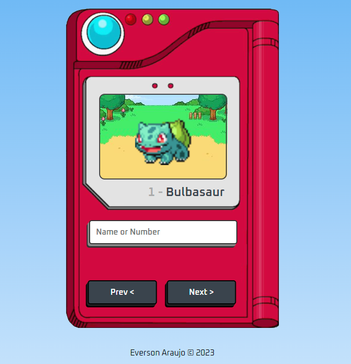

<h1>Pokédex Web App</h1>

Este é um aplicativo web simples que implementa uma Pokédex usando HTML, CSS e JavaScript. A Pokédex permite aos usuários pesquisar um Pokémon pelo nome ou número e exibe informações sobre o Pokémon, incluindo seu nome, número e uma Sprite animada.

<h2>Funcionamento</h2>

As principais partes do aplicativo são:

- HTML: O arquivo HTML contém a estrutura da Pokédex, incluindo o layout e os elementos que compõem as diferentes partes do aplicativo, como o formulário de pesquisa, a imagem e o nome e número do Pokémon.

- CSS: O arquivo CSS contém o estilo da Pokédex, incluindo a posição, tamanho e cores dos diferentes elementos.

- JavaScript: O arquivo JavaScript contém a lógica da Pokédex, incluindo os ouvintes de eventos para o formulário de pesquisa e os botões de navegação, as funções para buscar dados da PokéAPI e as funções para renderizar os dados na página.

O aplicativo usa o método fetch() para fazer solicitações à PokéAPI e recuperar dados sobre o Pokémon. Quando o usuário envia uma consulta de pesquisa, o aplicativo chama a função renderPokemon(), que faz uma solicitação à PokéAPI usando a consulta e atualiza a página com as informações sobre o Pokémon.

O aplicativo também possui botões de navegação que permitem ao usuário ir para o Pokémon anterior ou próximo. Quando o usuário clica em um desses botões, o aplicativo atualiza a consulta de pesquisa e chama a função renderPokemon() com a nova consulta.

<h2>Como usar</h2>
Para usar a Pokédex, basta abrir o link do Vercel (https://pokedex-codeverson.vercel.app/) e/ou abrindo o arquivo index.html em um navegador. Em seguida, basta digitar o nome ou número do Pokémon desejado no campo de pesquisa e clicar no botão de pesquisa. A página será atualizada com as informações do Pokémon. Para navegar entre os Pokémons, basta clicar nos botões de navegação.

