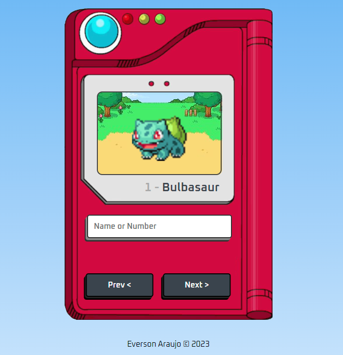

<h1>Pokédex Web App</h1>

This is a simple web application that implements a Pokédex using HTML, CSS, and JavaScript. The Pokédex allows users to search for a Pokémon by name or number and displays information about the Pokémon, including its name, number, and an animated sprite.

<h2>Functionality</h2>
The main parts of the application are:

- HTML: The HTML file contains the structure of the Pokédex, including the layout and elements that make up the different parts of the application, such as the search form, image, and Pokémon name and number.

- CSS: The CSS file contains the style of the Pokédex, including the position, size, and colors of the different elements.

- JavaScript: The JavaScript file contains the logic of the Pokédex, including event listeners for the search form and navigation buttons, functions for fetching data from the PokéAPI, and functions for rendering the data on the page.

The application uses the fetch() method to make requests to the PokéAPI and retrieve data about the Pokémon. When the user submits a search query, the application calls the renderPokemon() function, which makes a request to the PokéAPI using the query and updates the page with information about the Pokémon.

The application also has navigation buttons that allow the user to go to the previous or next Pokémon. When the user clicks on one of these buttons, the application updates the search query and calls the renderPokemon() function with the new query.

<h2>How to Use</h2>
To use the Pokédex, simply open the Vercel link (https://pokedex-codeverson.vercel.app/) and/or open the index.html file in a browser. Then, enter the desired Pokémon name or number in the search field and click the search button. The page will be updated with information about the Pokémon. To navigate between Pokémons, simply click on the navigation buttons.